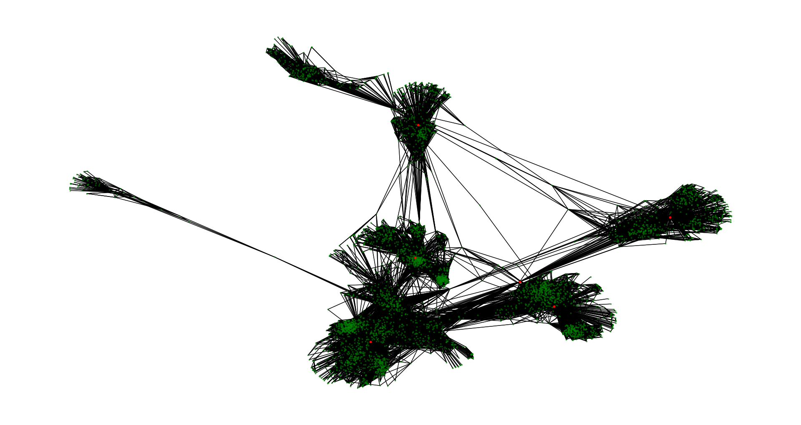

# Network-Analysis-Project
Using networkx to analyze a random generated graph and understand degree centrality and load centrality. 
## Base Graph
The network used in this project is a scale free graph, that is, the degree distribution of the network follows a power law. This results in some nodes being highly connected to other nodes and are called hubs. The internet is a scale free network. Every SOHO network has a switch/router to which many other devices are connected and these are then connected to servers, with a lot more steps in between, but if a graph of this network is plotted, one will find that the servers, though few in number, are connected to a lot more nodes, than the hubs and switches, and personal devices are are connected to fewer nodes still.  
The following figure is a plot of the graph used in this study.  
  
As can be clearly seen from this plot, there are some nodes around which other nodes are concentrated, such nodes are called hubs.   
## Degree Centrality
The number of nodes to which a given node is connected directly is called the degree centrality of that node. Nodes with higher degree centrality are more important in the network. In our internet analogy, importance can mean that the failure of a node with high degree centrality would mean a larger of number nodes being unable to connect to the internet. The following image shows 6 nodes with the highest degree centrality in orange.

To get this plot, ```nx.degree_centrality()```
method was used. This returns a dictionary with the keys being the nodes and the value, the centrality of that node. The dictionay was then turned into a list of tuples to sort them in descending order of centrality, then turned again into a dictionary and the top 6 items were extracted and the keys turned into a list and which were plotted on top of the base graph with a different colour and alpha. 
```python
centrality = nx.load_centrality(G)
dict_items=centrality.items()
dict_items_sorted = sorted(dict_items, key=lambda entity:entity[1], reverse = True)
centrality_sorted={k:v for k,v in dict_items_sorted}
node_ranks=list(centrality_sorted)[:8]
nx.draw(G, pos = layout, node_size=3, node_color="green", alpha = 0.5)
nx.draw(G, pos = layout, node_size=80, node_color="blue", nodelist = node_ranks, alpha = 1)
```
## Load Centrality
Load Centrality is slightly different from betweenness centrality. In our internet analogy, consider a SOHO network where a NAS is attached to a switch and the PC is also attached to the switch. The shortest path to go from PC to NAS involves going through the switch, the betweenness of the switch is 1. Now consider a smartphone connected wirelessly to the switch and to the PC. The shortest route from the phone to the NAS is through the switch. All other nodes can interact without having to go through other nodes. The betweenness centrality of the switch in this network is 2 and for all other nodes, it is zero.   
In this project however, the ```nx.load_centrality()``` method is used. This differs from the betweenness centrality slightly in that ["Load, or “betweenness centrality,” of a vertex is the accumulated total number of data packets passing through that vertex when every pair of vertices sends and receives a data packet along the shortest path connecting the pair."](https://journals.aps.org/prl/abstract/10.1103/PhysRevLett.87.278701)  
In other words, disruption of the nodes with high load centrality will affect a larger number of nodes already on the network and slow down the connection speed as the average length beween two nodes will increase(length here should be measured in terms of number of nodes in between two nodes, as opposed to hte physical distance as the graph layout might suggest). The following figure shows the 6 nodes with highest load centrality in red. 


